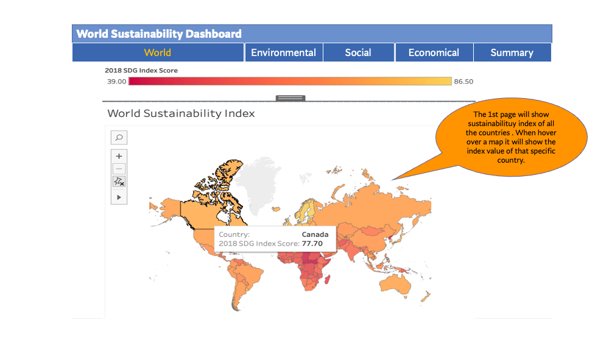
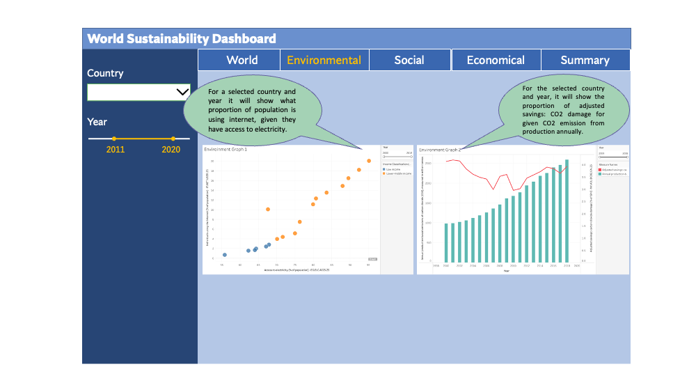
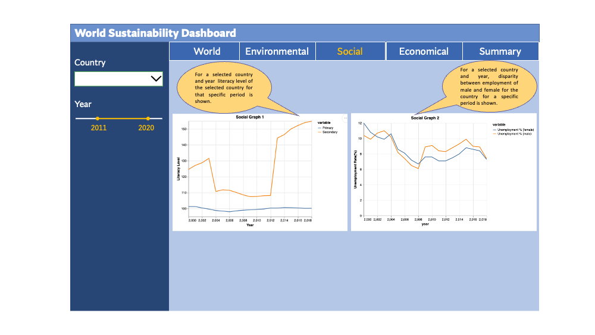
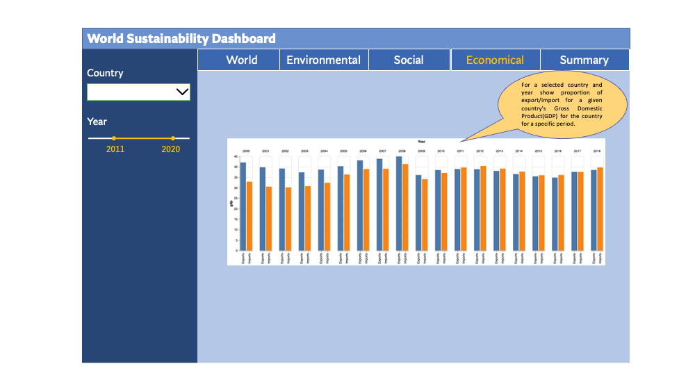
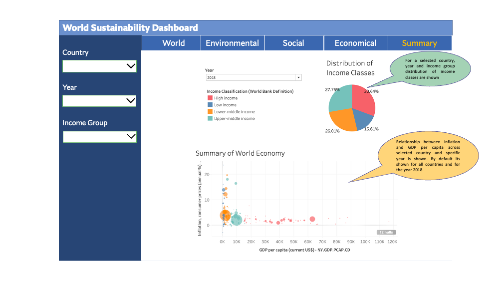

# DATA551_WSI

**Link to Heroku app -** https://data551-app-v1.herokuapp.com/

# WorldSustainabilityDashboard

World Sustainability Dashboard is created to track the performance of 173 countries against a range of sustainability metrics over a 19-year period from 2000 to 2018.

## App Description

The dashboard’s main shows world cloropath map based on the sustainability index. It shows sustainability index for all the countries. When hovered over the map it will show the index value of that specific country.

The second page shows two graphs of environmental data. One graph will show what proportion of the population is using the internet, given they have access to electricity. And the other graph will show the proportion of adjusted savings: CO2 damage for given CO2 emission from production annually.

The third page will show social graphs. One graph will show the literacy level of the selected country for the selected period. The second graph will show the disparity between the employment of males and females for the selected country, year, and period.

The fourth page will show one economic graph. Based on the selected country and year, it will show the proportion of export/imports for a given country's Gross Domestic Product(GDP) for the selected country for the specific period.

The last/fifth page will have two graphs both a bubble chart (bottom-left) and a pie chart (top-right). The bubble chart will show the relationship between Inflation and GDP per capita across the selected country and the selected year. By default for this chart, it shows for all countries and for the year 2018. For the pie-chart distribution of income classes are shown based on the selected country, year and income group.   

## App Sketch

### Page 1

### Page 2

### Page 3

### Page 4

### Page 5

## Other Files

You can find our `Code of Conduct` [here](./project_guidelines/Code_of_Conduct.md).

You can find our `Team Contract` [here](./project_guidelines/team-contract.md).

You can find our `Contribution` document [here](./project_guidelines/CONTRIBUTION.md).
